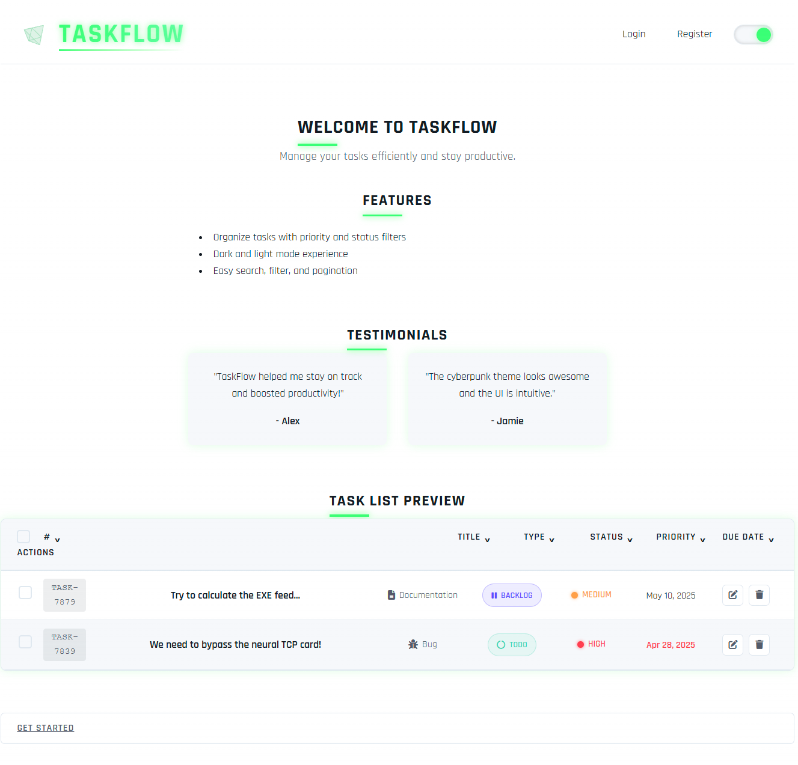
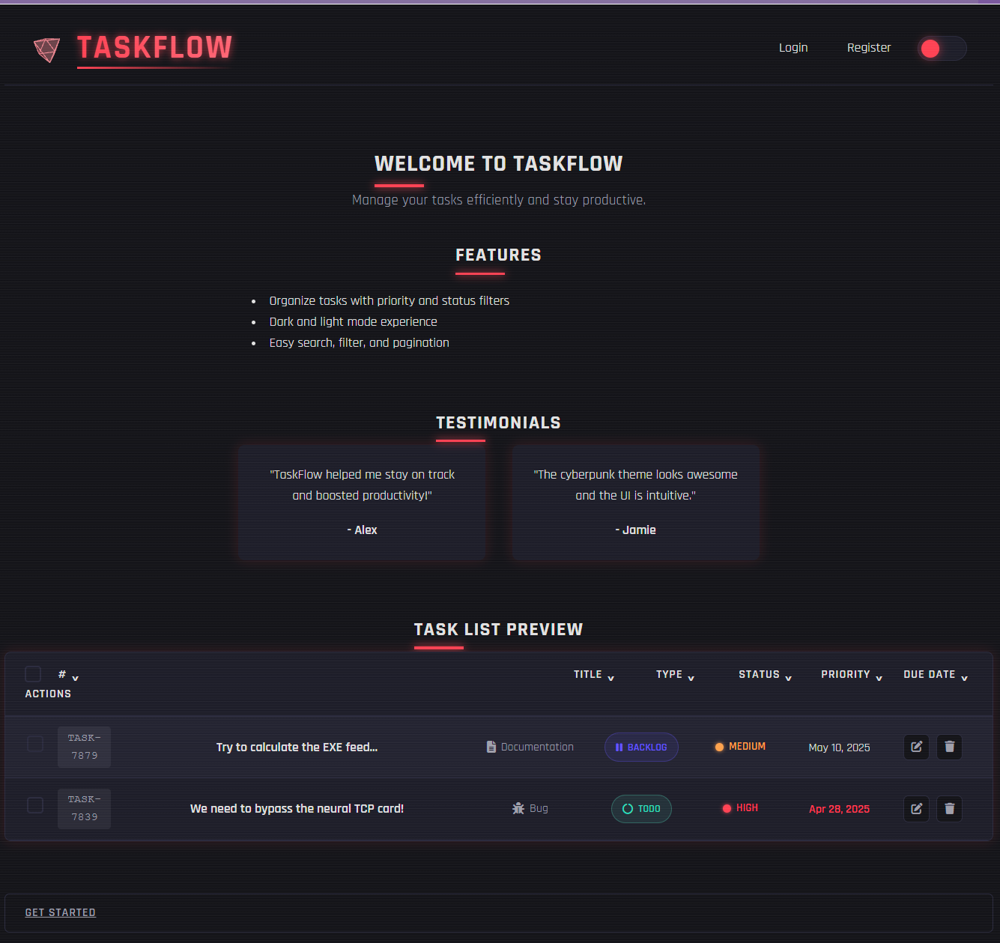
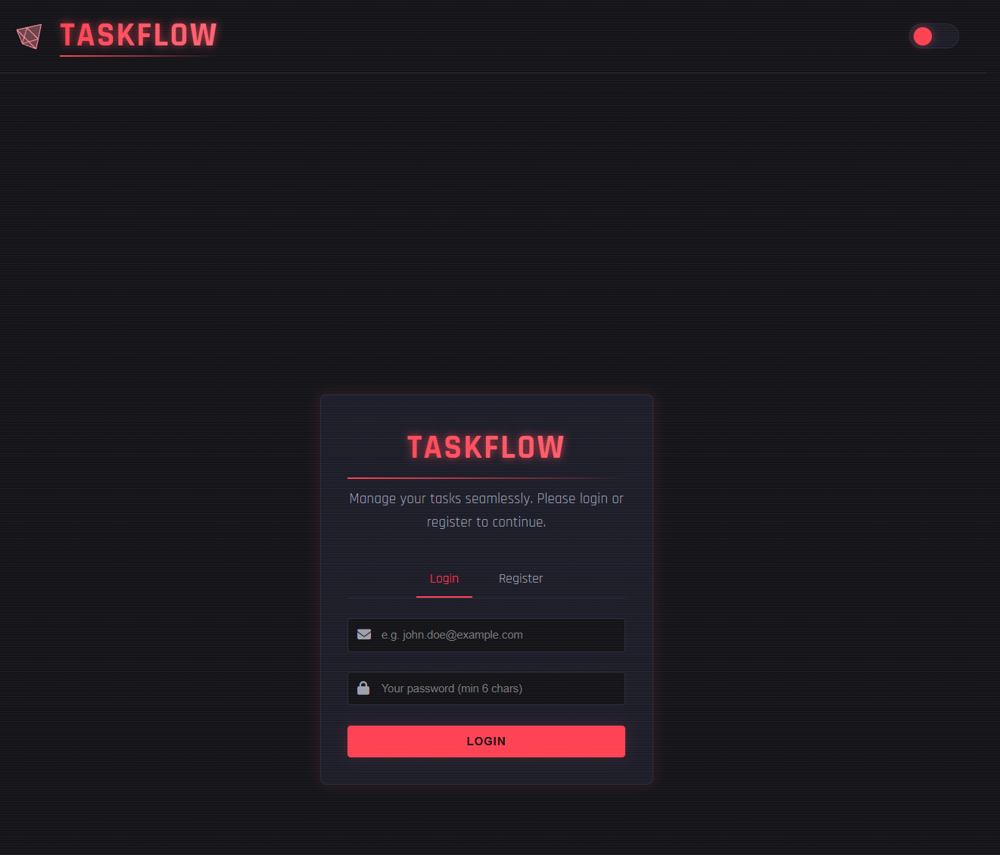
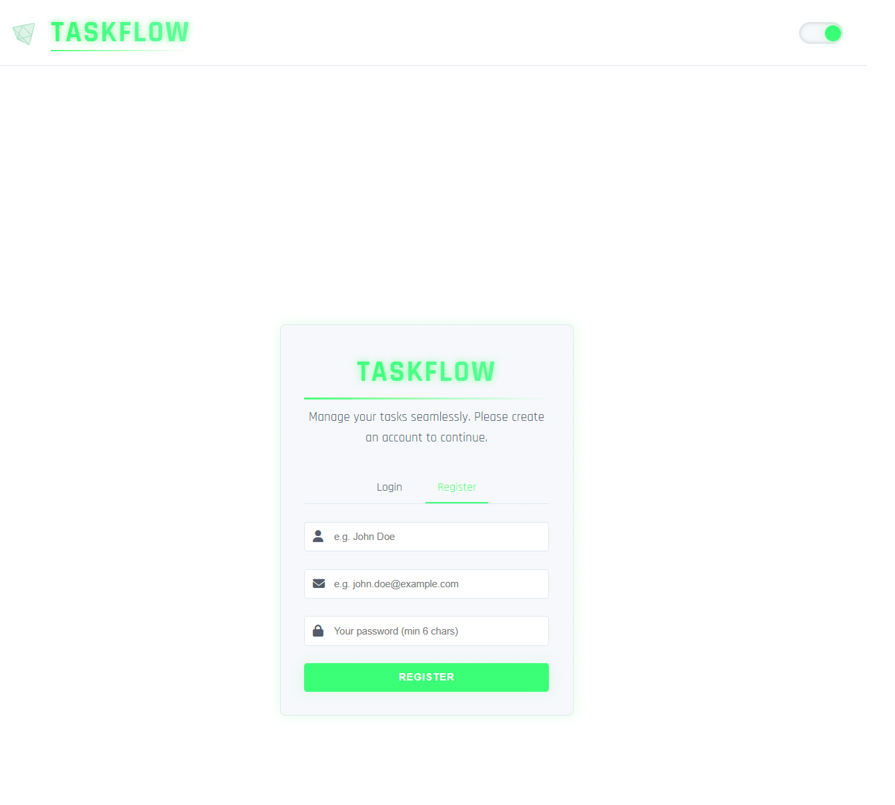
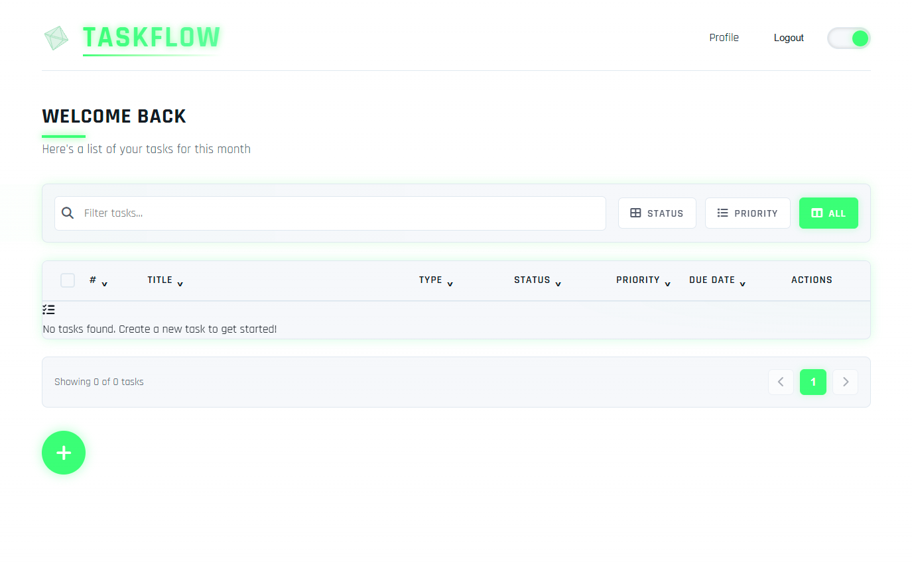
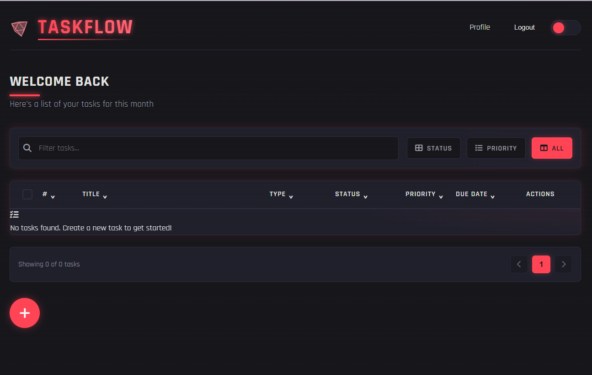

# TaskFlow

**TaskFlow** is a full-stack web-based task management application designed to help individuals and teams organize, track, and manage tasks efficiently. Built with a Vite-powered React frontend and a Spring Boot backend, it provides a scalable, secure, and user-friendly solution for task productivity.

---

## 🚀 Features

- ✅ JWT-based user authentication and role-based access control
- ✅ CRUD operations on tasks (Create, Read, Update, Delete)
- ✅ Advanced task filtering and sorting:
  - By status (Not Started, In Progress, Completed)
  - By priority (Low, Medium, High)
  - By due date
  - Text search across task titles and descriptions
- ✅ Bulk task operations (create, update, delete)
- ✅ Responsive UI with dark/light theme support
- ✅ Task categorization (Feature/Bug)
- ✅ Modern UI with cyberpunk-inspired design
- ✅ Real-time task status updates
- ✅ User profile management
- ✅ Secure password hashing with BCrypt
- ✅ PostgreSQL database with Prisma ORM
- ✅ Cloud-ready deployment configuration

---

## 🖼️ Wireframes

This section provides professional wireframes of the **TaskFlow** application in both light and dark themes across key pages.

### Home Page



### Login Page


### Register Page


### Dashboard Page




## 🎥 Demo Video
[](https://www.youtube.com/watch?v=_RQx_9v51IM)
*Click the image above to watch the demo video*


---

## 📁 Project Structure

```
taskflow/
├── backend/           # Spring Boot app
│   └── src/...       # Java source files
├── frontend/         # Vite + React app
│   ├── src/...      # React + TypeScript components
│   ├── prisma/      # Database schema and migrations
│   └── public/      # Static assets
├── docs/             # Documentation assets
│   └── imgs/         # Wireframe images
└── README.md         # Project readme
```

