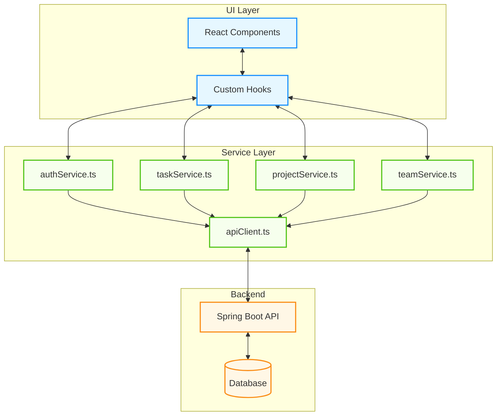
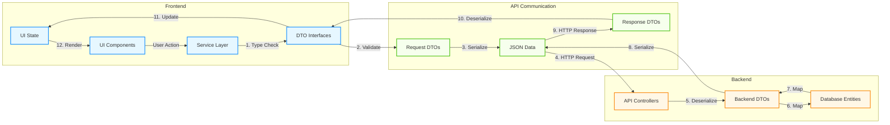

# API Interaction and Data Fetching Guide

## 1. Introduction and Purpose

A well-structured API interaction layer serves as the foundation for reliable communication between your frontend application and backend services. This guide outlines our architecture and best practices for handling API interactions in the TaskFlow application.

Rather than isolating API calls within individual components, we've implemented a dedicated service layer that manages all communication with the backend. This architectural decision yields several significant benefits:

**Maintainability**: When APIs change or evolve, updates are consolidated in one location rather than scattered throughout the codebase.

**Type Safety**: Our TypeScript implementation ensures data consistency between frontend and backend systems.

**Error Handling**: A unified approach to error processing provides consistent user experiences when issues arise.

**Testing**: Service abstractions facilitate mock implementations for testing UI components in isolation.

**Security**: Centralized authentication and authorization management ensures consistent security practices.

**Performance**: Strategic caching and request optimization improve application responsiveness.

## 2. Current State vs. Target State

### Moving from Mocks to Live APIs

The current `src/services/` directory contains mock implementations that simulate backend responses during initial development. Our roadmap involves gradually replacing these mocks with real API calls to the Spring Boot backend.

| Aspect | Current State | Target State |
|--------|--------------|-------------|
| Data Source | Static mock data | Live API endpoints |
| Authentication | Simulated | JWT-based auth flow |
| Error Handling | Minimal | Comprehensive strategy |
| Testing | Basic component tests | Full integration testing |
| Performance | No caching | Optimized data fetching |

This transition requires careful planning to maintain application functionality throughout the process. We'll implement changes incrementally, starting with non-critical features and moving toward core functionality as confidence in the implementation grows.

## 3. Service Layer Architecture

### 3.1 Core Principles

The service layer creates a clean separation between UI components and the backend API. This architectural boundary:


Each service file corresponds to a specific domain or resource within the application ecosystem:

| Service | Purpose | Key Operations |
|---------|---------|---------------|
| `authService.ts` | User authentication and session management | Login, logout, token refresh |
| `taskService.ts` | Task management operations | Create, read, update, delete tasks |
| `projectService.ts` | Project-related functionality | Manage projects, permissions |
| `teamService.ts` | Team collaboration features | Team assignments, member management |

### 3.2 Implementing Service Functions

When implementing service functions, focus on these core principles:

```typescript
// Example service function with key principles applied
export async function fetchTasks(projectId: string): Promise<Task[]> {
  try {
    // Type safety through generic parameter
    const response = await apiClient.get<Task[]>(`/projects/${projectId}/tasks`);
    return response.data;
  } catch (error) {
    // Resource-specific error handling
    if (error instanceof ApiError && error.status === 404) {
      throw new ApiError('Project not found', 404, { projectId });
    }
    throw error;
  }
}
```

This approach ensures that each service function:
- Returns strongly typed Promises
- Handles resource-specific error cases
- Documents API endpoints and parameters
- Implements proper error propagation

### 3.3 Service Implementation Pattern

Consider this pattern for implementing service functions:

```typescript
/**
 * [Brief description of functionality]
 * @param [param] - [Description of parameter]
 * @throws {ApiError} [Description of error scenarios]
 * @returns [Description of return value]
 */
export async function serviceFunction(param: ParamType): Promise<ReturnType> {
  try {
    const response = await apiClient.method<ReturnType>('endpoint');
    return response.data;
  } catch (error) {
    // Error handling specific to this resource/operation
    throw transformedError;
  }
}
```

## 4. API Client Configuration 

### 4.1 HTTP Client Comparison

When selecting an HTTP client for your API integration, consider these key factors:

| Feature | Native Fetch | Axios | Impact on Development |
|---------|-------------|-------|----------------------|
| Browser Support | Modern browsers | Universal with polyfills | Deployment target constraints |
| Request Interceptors | Manual | Built-in | Authentication workflow complexity |
| Response Transforms | Manual | Built-in | Data processing overhead |
| Error Handling | Manual parsing | Automatic | Development time for error cases |
| TypeScript Support | Basic | Extensive | Type safety and intellisense |
| Bundle Size | None (built-in) | ~5kb gzipped | Application performance |

Our application uses `fetch` for its lightweight nature and native browser support, though the principles apply to any HTTP client implementation.

### 4.2 Creating a Robust API Client

A well-designed API client handles:

1. **Base URL Configuration**: Environment-specific API endpoints
2. **Authentication**: Automatic token management
3. **Request/Response Processing**: Consistent data handling
4. **Error Transformation**: Converting HTTP errors to application-specific errors
5. **Retry Logic**: Handling transient failures

Here's how these components work together:

```typescript
// Key components of apiClient.ts (simplified)

// 1. Configuration
const API_BASE_URL = import.meta.env.VITE_API_BASE_URL || 'http://localhost:8080/api';

// 2. Request function with retry logic
async function request(endpoint: string, options: RequestConfig = {}): Promise<any> {
  const url = `${API_BASE_URL}${endpoint}`;
  const { retry = 3, retryDelay = 1000, ...fetchOptions } = options;

  // 3. Authentication header management
  const headers = await prepareHeaders(options.headers);
  
  try {
    // 4. Fetch with retry capability
    const response = await fetchWithRetry(url, { ...fetchOptions, headers }, retry, retryDelay);
    // 5. Response processing
    return handleResponse(response);
  } catch (error) {
    // 6. Error transformation
    throw handleError(error);
  }
}
```

### 4.3 Authentication Management

Token-based authentication requires careful management of:

- **Token Storage**: Secure storage mechanism
- **Token Refresh**: Automatic renewal of expired tokens
- **Token Validation**: Checking expiration before requests
- **Authentication Errors**: Handling unauthorized scenarios

```typescript
async function addAuthHeader(headers: Record<string, string>): Promise<void> {
  let token = getAuthToken();
  
  if (!token) return;

  // Check token expiration and refresh if needed
  if (isTokenExpired(token)) {
    try {
      token = await refreshToken();
    } catch (error) {
      // Handle refresh failure - typically redirect to login
      redirectToLogin();
      return;
    }
  }

  headers['Authorization'] = `Bearer ${token}`;
}
```

## 5. Data Transfer Objects (DTOs)

### 5.1 The Purpose of DTOs

Data Transfer Objects create a contract between frontend and backend systems:


DTOs serve multiple purposes in our architecture:

1. **Type Safety**: They provide compile-time checking of data structures
2. **Documentation**: They self-document the expected shape of API data
3. **Validation**: They define required versus optional fields
4. **Separation of Concerns**: They distinguish between different operations

### 5.2 Types of DTOs

Our application employs several types of DTOs:

| DTO Type | Purpose | Example |
|----------|---------|---------|
| Entity Types | Full data representation | `Task`, `Project`, `User` |
| Create DTOs | Data for creation operations | `TaskCreateDTO` |
| Update DTOs | Partial data for updates | `TaskUpdateDTO` |
| Request DTOs | Parameters for list/search | `TaskListParams` |
| Response DTOs | Specialized response formats | `TaskListResponse` |

### 5.3 DTO Examples

**Base Entity**:
```typescript
export interface BaseEntity {
  id: string;
  createdAt: string;
  updatedAt: string;
}
```

**Main Entity**:
```typescript
export interface Task extends BaseEntity {
  title: string;
  description?: string;
  status: TaskStatus;
  priority: TaskPriority;
  dueDate?: string;
  projectId: string;
  assigneeId?: string;
  
  // Expanded relations
  project?: Project;
  assignee?: User;
  
  // Computed fields
  isOverdue: boolean;
  completionPercentage: number;
}
```

**Create DTO**:
```typescript
export interface TaskCreateDTO {
  title: string;
  description?: string;
  status?: TaskStatus; // Defaults to TODO
  priority: TaskPriority;
  dueDate?: string;
  projectId: string;
  assigneeId?: string;
}
```

**Update DTO**:
```typescript
export interface TaskUpdateDTO {
  title?: string;
  description?: string;
  status?: TaskStatus;
  priority?: TaskPriority;
  dueDate?: string;
  assigneeId?: string;
}
```

### 5.4 DTO Best Practices

**Type Inheritance and Extension**:
Use TypeScript's interface inheritance to build relationships between DTOs:

```typescript
// Base interface for all task-related DTOs
interface TaskBase {
  title: string;
  description?: string;
}

// Create DTO extends the base and adds required fields
interface TaskCreateDTO extends TaskBase {
  projectId: string;
  priority: TaskPriority;
}

// Update DTO makes all fields optional
type TaskUpdateDTO = Partial<TaskBase> & {
  status?: TaskStatus;
  priority?: TaskPriority;
  dueDate?: string;
  assigneeId?: string;
};
```

**Naming Conventions**:
Adopt consistent naming patterns across your application:

- Entity types: Use the domain name (`Task`)
- Create DTOs: Append `CreateDTO` (`TaskCreateDTO`)
- Update DTOs: Append `UpdateDTO` (`TaskUpdateDTO`)
- List parameters: Append `ListParams` (`TaskListParams`)
- List responses: Append `ListResponse` (`TaskListResponse`)

## 6. Error Handling Strategy

### 6.1 Error Categories

Different types of errors require different handling strategies:

| Category | HTTP Status | Description | Example | User Experience |
|----------|-------------|-------------|---------|----------------|
| Authentication | 401 | Invalid or missing token | Expired JWT | Redirect to login |
| Authorization | 403 | Insufficient permissions | Non-admin accessing admin area | "You don't have permission" |
| Validation | 400 | Invalid input data | Future date in "birthdate" field | Highlight field with error message |
| Not Found | 404 | Resource doesn't exist | Task ID not in database | "The requested [resource] was not found" |
| Conflict | 409 | Resource conflict | Duplicate username | "This [field] is already in use" |
| Rate Limit | 429 | Too many requests | API quota exceeded | "Please try again in [time]" |
| Server Error | 500 | Backend failure | Database connection error | "Something went wrong, please try again" |
| Network | N/A | Connection issues | Offline status | "Check your internet connection" |

### 6.2 Custom Error Types

A well-designed error system includes specialized error classes:

```typescript
// Base API Error class
export class ApiError extends Error {
  constructor(
    message: string,
    public status: number,
    public errors?: Record<string, any>
  ) {
    super(message);
    this.name = 'ApiError';
  }

  // Helper methods for error categorization
  isValidationError(): boolean {
    return this.status === 400;
  }

  isAuthError(): boolean {
    return this.status === 401 || this.status === 403;
  }
}

// Network-specific error
export class NetworkError extends Error {
  constructor(
    message: string = 'Network error occurred',
    public originalError?: Error
  ) {
    super(message);
    this.name = 'NetworkError';
  }
}
```

### 6.3 Implementing Error Handling

Create a centralized error handling utility that processes different error types:

```typescript
export function handleApiError(error: unknown): void {
  if (error instanceof ApiError) {
    // Handle different API error categories
    if (error.isValidationError()) {
      handleValidationError(error);
    } else if (error.isAuthError()) {
      handleAuthError(error);
    } else if (error.isServerError()) {
      handleServerError(error);
    }
  } else if (error instanceof NetworkError) {
    // Handle network-specific errors
    handleNetworkError(error);
  } else {
    // Handle unknown errors
    handleUnknownError(error);
  }
}
```

### 6.4 Error Handling in Components

Implement error handling in component hooks:

```typescript
export function useTaskCreation() {
  const [isLoading, setIsLoading] = useState(false);
  const [error, setError] = useState<ApiError | null>(null);

  const createTask = async (taskData: TaskCreateDTO) => {
    setIsLoading(true);
    setError(null);
    
    try {
      const task = await taskService.createTask(taskData);
      toast.success('Task created successfully');
      return task;
    } catch (err) {
      const apiError = err instanceof ApiError ? err : new ApiError('Unknown error', 500);
      setError(apiError);
      handleApiError(apiError);
      return null;
    } finally {
      setIsLoading(false);
    }
  };

  return { createTask, isLoading, error };
}
```

## 7. Testing API Interactions

### 7.1 Testing Approach

Test API interactions at multiple levels:

| Test Type | Focus | Tools |
|-----------|-------|-------|
| Unit Tests | Individual service functions | Jest, Mock Service Worker |
| Integration Tests | Service interactions | React Testing Library, Mock API |
| E2E Tests | Complete user flows | Cypress, Playwright |

### 7.2 Mocking API Responses

Use Mock Service Worker (MSW) to intercept and mock API requests:

```typescript
// Example MSW setup for testing
import { rest } from 'msw';
import { setupServer } from 'msw/node';

// Mock API responses
const handlers = [
  rest.get('/api/tasks', (req, res, ctx) => {
    return res(
      ctx.status(200),
      ctx.json([
        { id: '1', title: 'Task 1', status: 'TODO' },
        { id: '2', title: 'Task 2', status: 'IN_PROGRESS' }
      ])
    );
  }),
  
  rest.post('/api/tasks', (req, res, ctx) => {
    return res(
      ctx.status(201),
      ctx.json({ id: '3', ...req.body })
    );
  })
];

const server = setupServer(...handlers);

// Setup/teardown
beforeAll(() => server.listen());
afterEach(() => server.resetHandlers());
afterAll(() => server.close());
```

### 7.3 Testing Service Functions

```typescript
test('fetchTasks returns tasks for a project', async () => {
  // Arrange
  const projectId = 'project-123';
  
  // Act
  const tasks = await taskService.fetchTasks(projectId);
  
  // Assert
  expect(tasks).toHaveLength(2);
  expect(tasks[0].id).toBe('1');
  expect(tasks[1].id).toBe('2');
});

test('createTask throws validation error for invalid data', async () => {
  // Arrange
  server.use(
    rest.post('/api/tasks', (req, res, ctx) => {
      return res(
        ctx.status(400),
        ctx.json({
          message: 'Validation error',
          errors: { title: 'Title is required' }
        })
      );
    })
  );
  
  // Act & Assert
  await expect(taskService.createTask({ title: '' })).rejects.toThrow('Validation error');
});
```

## 8. Performance Optimization

### 8.1 Request Caching

Implement a caching strategy to minimize redundant API calls:

```typescript
// Simplified cache implementation
const cache = new Map<string, { data: any, timestamp: number }>();
const CACHE_TTL = 5 * 60 * 1000; // 5 minutes

export async function fetchWithCache<T>(
  key: string,
  fetchFn: () => Promise<T>,
  ttl: number = CACHE_TTL
): Promise<T> {
  const cached = cache.get(key);
  const now = Date.now();
  
  // Return from cache if valid
  if (cached && now - cached.timestamp < ttl) {
    return cached.data;
  }
  
  // Fetch fresh data
  const data = await fetchFn();
  
  // Update cache
  cache.set(key, { data, timestamp: now });
  
  return data;
}
```

### 8.2 Request Batching

Implement batching for multiple related requests:

```typescript
export async function batchUpdateTaskStatus(
  taskIds: string[], 
  status: TaskStatus
): Promise<void> {
  // Send one request instead of multiple
  await apiClient.patch('/tasks/batch-status', { 
    taskIds, 
    status 
  });
}
```

### 8.3 Pagination and Infinite Scrolling

Optimize data loading with pagination:

```typescript
export async function fetchTasksPaginated(
  params: TaskListParams
): Promise<TaskListResponse> {
  const { page = 0, pageSize = 20, ...filters } = params;
  
  const response = await apiClient.get<TaskListResponse>('/tasks', {
    params: {
      page,
      pageSize,
      ...filters
    }
  });
  
  return response.data;
}
```

## 9. Advanced Patterns

### 9.1 Middleware Pattern

Implement middleware for cross-cutting concerns:

```typescript
// Middleware for logging
function loggerMiddleware(req: RequestConfig): RequestConfig {
  console.log(`${req.method} ${req.url}`);
  return req;
}

// Middleware for analytics
function analyticsMiddleware(req: RequestConfig): RequestConfig {
  trackApiCall(req.url);
  return req;
}

// Apply middleware
const request = applyMiddleware(
  baseRequest,
  loggerMiddleware,
  analyticsMiddleware
);
```

### 9.2 Query Building Pattern

Create a fluent API for complex queries:

```typescript
// Usage example
const tasks = await new TaskQuery()
  .inProject('project-123')
  .withStatus(['TODO', 'IN_PROGRESS'])
  .assignedTo('user-456')
  .dueBefore('2023-12-31')
  .sortBy('dueDate', 'asc')
  .paginate(0, 20)
  .execute();
```

### 9.3 Event-Based Communication

Implement an event system for service communication:

```typescript
// Subscribe to events
apiEvents.on('task:created', (task) => {
  // Update UI or other state
});

// Emit events from services
export async function createTask(taskData: TaskCreateDTO): Promise<Task> {
  const task = await apiClient.post<Task>('/tasks', taskData);
  apiEvents.emit('task:created', task);
  return task;
}
```

## 10. Conclusion

A well-structured API interaction layer is critical for maintaining a robust, maintainable frontend application. By implementing the patterns and practices outlined in this guide, you can ensure:

1. Clear separation of concerns between UI and data access
2. Type-safe interactions with backend systems
3. Consistent error handling and user feedback
4. Optimized performance for API operations
5. Testable service implementations
