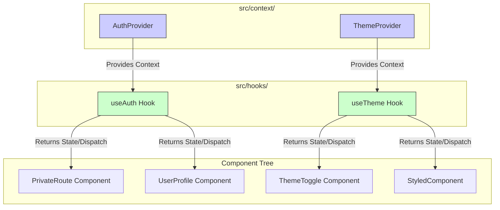
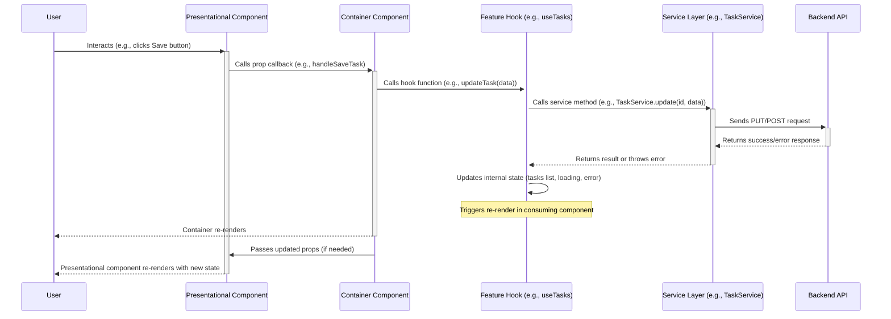

# State Management and Component Design Guide

## Introduction
This guide details the strategies employed for managing state and the architectural patterns used for designing React components within the TaskFlow frontend. Understanding these interconnected concepts is crucial for building predictable, maintainable, and scalable UI features.

## 1. State Management Philosophy

The primary goal of state management in TaskFlow is to maintain data consistency throughout the application while minimizing complexity and optimizing performance, particularly by avoiding unnecessary re-renders. To achieve this, we employ a dual strategy: utilizing global state management for broadly shared, cross-cutting concerns, and adopting localized state management for data specific to individual components or distinct feature areas.

## 2. Global State Management (Context API)

### 2.1. Purpose and Implementation
React's Context API serves as the foundation for managing global state – data that needs to be accessible across multiple, potentially deeply nested components without resorting to prop drilling. This approach is ideal for application-wide concerns such as authentication status, user preferences, or the currently active theme. The core implementations of these global contexts reside within the `src/context/` directory.

### 2.2. Key Context Providers
The application relies on several key context providers to manage specific global state domains:

-   **`AuthProvider`**: This provider is central to managing the user's authentication lifecycle. It typically holds the authentication status (logged in/out), session tokens, functions for login/logout, and potentially caches basic user profile information retrieved upon successful authentication.
-   **`ThemeProvider`**: Responsible for managing the application's visual theme. It holds the current theme state (e.g., 'light' or 'dark') and likely provides the necessary mechanisms (CSS variables or theme objects) used by components and the styling system (`cyberpunk.css`, Tailwind) to adapt appearances accordingly.

While these are the primary global contexts identified, others like a `TaskContext` might exist or be introduced if specific data, such as a globally accessible task list or filter settings, requires broad availability across disparate parts of the component tree.

### 2.3. Consumption Pattern
Accessing global state within components is facilitated through dedicated custom hooks associated with each context (e.g., `useAuth()`, `useTheme()`). This pattern encapsulates the underlying `React.useContext` call, providing a clean, context-specific API for consuming components. It simplifies state access and makes components less coupled to the direct implementation details of the context itself.


*Diagram: Global state flow from Context Providers through Custom Hooks to consuming Components.*

## 3. Local and Feature State Management (Hooks)

### 3.1. Purpose and Implementation
For state that is relevant only within a single component or confined to a specific feature's branch of the UI tree, localized state management is preferred. This is achieved using standard React hooks like `useState` and `useReducer` directly within components, or by encapsulating logic within custom hooks located in `src/hooks/`.

### 3.2. Custom Hooks (`src/hooks/`)
Custom hooks are a cornerstone of our state management and logic abstraction strategy. They reside in `src/hooks/` and serve to encapsulate reusable stateful logic, side effects (particularly data fetching operations interacting with the service layer), complex calculations, or form handling logic (e.g., `useTasks`, `useFormValidation`). By extracting this logic, custom hooks enhance code reusability, improve testability, and keep component code focused primarily on rendering and user interaction.

### 3.3. State Colocation Principle
A guiding principle is **state colocation**: state should reside as close as possible to where it is primarily used. Global state via Context API is reserved for truly application-wide necessities. Otherwise, state should be lifted only as high as necessary in the component tree, ideally managed within the component or custom hook directly associated with the feature that requires it. This minimizes unnecessary propagation of state and reduces the potential for performance bottlenecks.

## 4. Component Design Patterns

Component architecture in TaskFlow follows established React patterns to promote clarity, reusability, and maintainability.

### 4.1. Container/Presentational Pattern Distinction
While not always enforced with rigid separation, components are generally designed with a distinction between container (smart) and presentational responsibilities. This separation helps clarify roles and improves reusability.

| Component Type           | Key Responsibilities                                                                                                 | State Awareness                                     | Data Fetching | Reusability          |
| :----------------------- | :------------------------------------------------------------------------------------------------------------------- | :-------------------------------------------------- | :------------ | :------------------- |
| **Container (Smart)**    | Orchestrating data flow, managing feature state, handling side effects (via hooks), consuming contexts, rendering children. | Aware of application/feature state, uses hooks.     | Often initiates | Lower (feature-specific) |
| **Presentational**       | Rendering UI based on props, displaying data, invoking callbacks passed via props.                                       | Generally stateless or minimal UI state (`useState`). | None          | Higher (generic UI)    |

Container components are often found at the page level or as wrappers for significant features (like `TaskFlowDashboard`). They utilize hooks (`useAuth`, `useTasks`, etc.) to gather data and logic, passing necessary pieces down as props. Presentational components (like a generic `Button` or `TaskCard`) receive data via props and are primarily concerned with visual representation.

### 4.2. Composition Over Inheritance
Complex UI structures are built by **composing** smaller, single-purpose components rather than relying on inheritance. This is a fundamental React principle. Features like the `children` prop are used extensively to create flexible layout components (`Layout.tsx`), wrappers (`PrivateRoute.tsx`), and components that can render arbitrary content provided by their parent.

### 4.3. Hook-Driven Logic Extraction
A significant aspect of the component design is the **extraction of logic into custom hooks**. Business logic, state management, API interactions, and side effects are moved out of the component body and into reusable hooks (`useTasks`, `useAuth`). This approach results in leaner components that are primarily focused on rendering the UI based on the state and props provided by these hooks. It significantly improves the testability of both the component (which becomes more declarative) and the extracted logic (which can be tested in isolation).

## 5. Connecting State and Components: The Interaction Flow

The synergy between state management strategies and component design patterns defines how the application behaves and updates. Typically, container/smart components act as the bridge. They leverage context-based hooks (`useAuth`, `useTheme`) to subscribe to global state changes and employ feature-specific custom hooks (`useTasks`) to manage local data and interactions. The data values and callback functions returned by these hooks are then passed down as props to the relevant presentational components responsible for rendering the UI. Within custom hooks, interactions with the backend often occur via the `Service Layer`, with the hook managing the asynchronous nature of these calls, including loading and error states, before updating the state consumed by the component.



### Example: Container/Presentational Pattern

This pattern separates concerns: the **Container** component fetches data and manages state, while the **Presentational** component focuses solely on rendering the UI based on the props it receives.

**`TaskListContainer.tsx` (Container Component)**

```typescript
import React, { useState, useEffect } from 'react';
import { TaskListView } from './TaskListView';
import { fetchTasks } from '../services/taskService'; // Assume a service exists

interface Task {
  id: string;
  title: string;
  completed: boolean;
}

export function TaskListContainer() {
  const [tasks, setTasks] = useState<Task[]>([]);
  const [isLoading, setIsLoading] = useState<boolean>(true);
  const [error, setError] = useState<string | null>(null);

  useEffect(() => {
    async function loadTasks() {
      try {
        setIsLoading(true);
        setError(null);
        const fetchedTasks = await fetchTasks();
        setTasks(fetchedTasks);
      } catch (err) {
        setError('Failed to load tasks.');
        console.error(err);
      } finally {
        setIsLoading(false);
      }
    }
    loadTasks();
  }, []);

  if (isLoading) return <div>Loading tasks...</div>;
  if (error) return <div>Error: {error}</div>;

  // Passes data and potentially callbacks down to the presentational component
  return <TaskListView tasks={tasks} />;
}
```

**`TaskListView.tsx` (Presentational Component)**

```typescript
import React from 'react';
import { Card, CardBody, Listbox, ListboxItem } from "@nextui-org/react"; // Example UI components

interface Task {
  id: string;
  title: string;
  completed: boolean;
}

interface TaskListViewProps {
  tasks: Task[];
  // Could also receive handlers like onToggleComplete, onDeleteTask etc. from the container
}

export function TaskListView({ tasks }: TaskListViewProps) {
  if (tasks.length === 0) {
    return <p>No tasks found.</p>;
  }

  return (
    <Card>
      <CardBody>
        <Listbox aria-label="Task list">
          {tasks.map((task) => (
            <ListboxItem
              key={task.id}
              textValue={task.title} // For accessibility
              className={task.completed ? 'line-through text-gray-500' : ''}
            >
              {task.title}
            </ListboxItem>
          ))}
        </Listbox>
      </CardBody>
    </Card>
  );
}

```

### Example: Custom Hook (`useTasks`)

A custom hook encapsulates task-related state logic, making it reusable across different components.

```typescript
import { useState, useEffect, useCallback } from 'react';
import { fetchTasks, addTask as apiAddTask, updateTask as apiUpdateTask } from '../services/taskService'; // Assume service functions

interface Task {
  id: string;
  title: string;
  completed: boolean;
}

interface UseTasksReturn {
  tasks: Task[];
  isLoading: boolean;
  error: string | null;
  addTask: (title: string) => Promise<void>;
  toggleTask: (id: string) => Promise<void>;
  // Add other actions like deleteTask, filterTasks etc.
}

export function useTasks(): UseTasksReturn {
  const [tasks, setTasks] = useState<Task[]>([]);
  const [isLoading, setIsLoading] = useState<boolean>(true);
  const [error, setError] = useState<string | null>(null);

  // Fetch initial tasks
  useEffect(() => {
    async function loadTasks() {
      try {
        setIsLoading(true);
        setError(null);
        const fetchedTasks = await fetchTasks();
        setTasks(fetchedTasks);
      } catch (err) {
        setError('Failed to load tasks.');
        console.error(err);
      } finally {
        setIsLoading(false);
      }
    }
    loadTasks();
  }, []);

  // Add a new task
  const addTask = useCallback(async (title: string) => {
    if (!title.trim()) return; // Basic validation
    try {
        setError(null);
        // Optimistic UI update (optional)
        // const optimisticId = `temp-${Date.now()}`;
        // setTasks(prev => [...prev, { id: optimisticId, title, completed: false }]);

        const newTask = await apiAddTask({ title }); // Call API
        // Replace optimistic update or add if not optimistic
        // setTasks(prev => prev.map(t => t.id.startsWith('temp-') ? newTask : t)); // Example if optimistic
        // Or setTasks(prev => [...prev, newTask]); // If not optimistic
        // Ideally fetch again or ensure API returns the full new task object
        const updatedTasks = await fetchTasks(); // Refresh list after add
        setTasks(updatedTasks);

    } catch (err) {
        setError('Failed to add task.');
        // Rollback optimistic update if needed
        console.error(err);
    }
  }, []); // Dependencies based on what API functions need

  // Toggle task completion
  const toggleTask = useCallback(async (id: string) => {
     const taskToToggle = tasks.find(task => task.id === id);
     if (!taskToToggle) return;

     // Optimistic UI update
     setTasks(prevTasks =>
        prevTasks.map(task =>
            task.id === id ? { ...task, completed: !task.completed } : task
        )
     );

     try {
         setError(null);
         await apiUpdateTask(id, { completed: !taskToToggle.completed });
         // API call successful, optimistic update is correct
     } catch (err) {
         setError('Failed to update task status.');
         // Rollback optimistic update
         setTasks(prevTasks =>
            prevTasks.map(task =>
                task.id === id ? { ...task, completed: taskToToggle.completed } : task
            )
         );
         console.error(err);
     }
  }, [tasks]); // Dependency on tasks to get the current state for toggling

  return { tasks, isLoading, error, addTask, toggleTask };
}

// --- Usage in a component ---
// import { useTasks } from './hooks/useTasks';
//
// function MyTaskComponent() {
//   const { tasks, isLoading, error, addTask, toggleTask } = useTasks();
//
//   if (isLoading) return <p>Loading...</p>;
//   if (error) return <p>Error: {error}</p>;
//
//   return (
//     <div>
//       {/* Render tasks using the 'tasks' array */}
//       {/* Add input and button to call 'addTask' */}
//       {/* Add buttons/checkboxes to call 'toggleTask' */}
//     </div>
//   );
// }

``` 