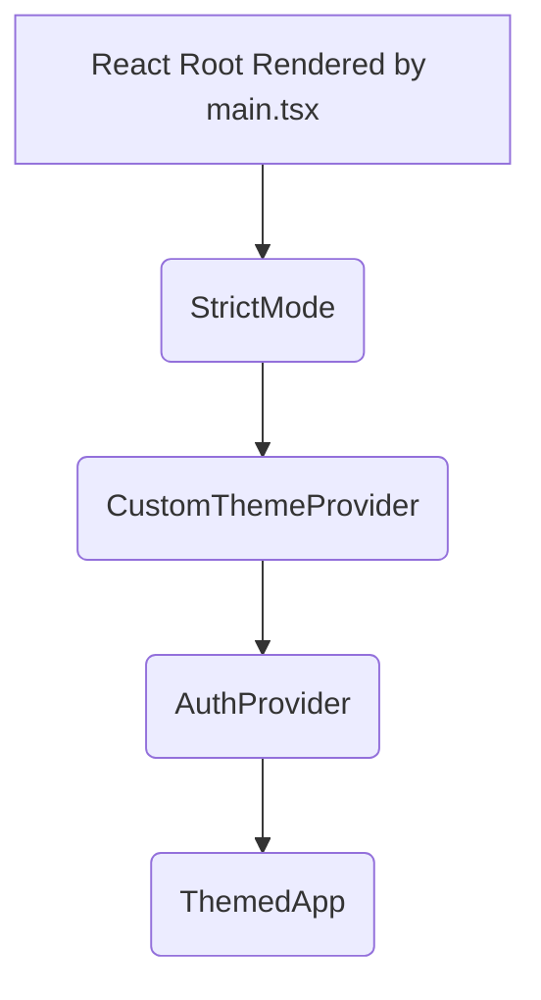
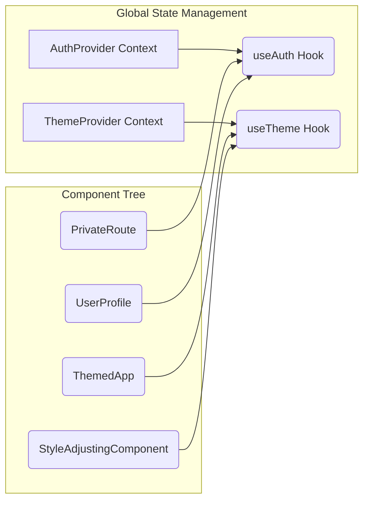
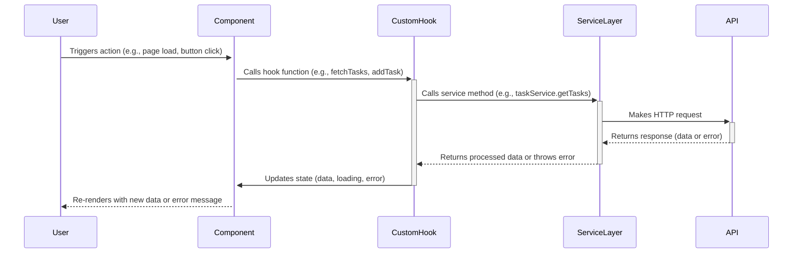

# TaskFlow Frontend Architecture Guide

## Introduction
This guide provides an in-depth analysis of the TaskFlow frontend architecture. It aims to explain not just *what* components and patterns are used, but *how* they interact and *why* specific design decisions were made. Understanding these connections is crucial for maintaining and extending the application effectively.

## 1. Core Application Initialization and Structure

### 1.1. Entry Point (`main.tsx`)
The application's journey begins in `main.tsx`, which sets up the React root using React 18's `createRoot` for concurrent rendering capabilities and establishes the foundational context for the entire application. This entry point strategically wraps the core application component, `ThemedApp`, with essential providers to ensure global access to critical functionalities.



The provider hierarchy starts with React's `StrictMode`, activating additional development checks to identify potential issues early. Next, `CustomThemeProvider` (from `src/context/ThemeContext`) is placed high in the structure, making theme information like color schemes universally available. Nested within this is `AuthProvider` (from `src/context/AuthProvider`), responsible for managing the application's authentication state, including user details and tokens. Its position allows it to potentially access theme context while ensuring authentication status is available downstream. Finally, `ThemedApp` (from `src/components/ThemedApp`) sits at the core, consuming both theme and authentication contexts to tailor its rendering and behavior. This component typically integrates the application's main router setup. Global styles, encompassing the base `index.css` and the specific `cyberpunk.css` theme, are imported in `main.tsx` to guarantee universal application before component rendering.

### 1.2. Root Component (`App.tsx` - inferred location)
While `ThemedApp` handles context consumption, the responsibility for routing and primary layout often falls to a component like `App.tsx`. This component would utilize a routing library (e.g., React Router) to define application routes and render the main `Layout` component. It orchestrates which page component is displayed based on the current route, often employing `PrivateRoute` to guard authenticated sections.

## 2. Directory Organization: Rationale and Structure

The `src` directory's organization is deliberately structured to enhance modularity, enforce a clear separation of concerns, and improve maintainability. Each directory serves a distinct purpose within the architecture.

```
src/
├── assets/      # Static files (images, fonts) - not involved in logic flow.
├── components/  # UI building blocks, organized by feature or shared purpose.
├── context/     # Global state providers (Theme, Auth). Centralizes cross-cutting concerns.
├── hooks/       # Reusable logic abstractions, often related to state or side effects.
├── pages/       # Top-level components representing distinct application views/routes.
├── services/    # API interaction layer. Isolates external communication.
├── styles/      # Global CSS files and theme definitions.
├── types/       # Shared TypeScript interfaces and type definitions. Ensures consistency.
└── utils/       # Common helper functions, independent of specific features.
```

This layout logically separates UI concerns (`components`, `pages`) from state management (`context`, `hooks`), external data interactions (`services`), and foundational setup (`main.tsx`, `App.tsx`). Co-locating feature-specific code within these layers (e.g., task-related components in `components/task/`) streamlines development and comprehension.

## 3. Component Architecture: Building the UI

The application's user interface is constructed through a hierarchy of React components, located primarily within the `src/components/` and `src/pages/` directories.

### 3.1. Core Layout and Navigation
The foundational UI structure is established by several key components. `Layout.tsx` provides the persistent visual shell, such as headers or sidebars, arranging the main content area where page components are rendered. `ActivityBar.tsx` typically offers primary navigation controls, linking to different application sections or views, potentially managed by the routing state. `ThemedApp.tsx` wraps the application, applying global styles derived from the `ThemeContext`. Access control is managed by `PrivateRoute.tsx`, which acts as a gatekeeper for authenticated routes by consulting the `AuthProvider` context and redirecting unauthorized users.

### 3.2. Dashboard Structure (`TaskFlowDashboard.tsx`)
As the central hub for the main application view, `TaskFlowDashboard.tsx` orchestrates the primary user experience. It often fetches essential data, likely through custom hooks like `useTasks`, and manages the layout and data distribution to various specialized panel components, acting as a control center for the dashboard panels.

### 3.3. Panel Components
The dashboard's functionality is broken down into several dedicated panel components: `PropertiesPanel`, `TimelinePanel`, `MainContentPanel`, and `ExplorerPanel`. These components receive data as props from `TaskFlowDashboard` or fetch specific data themselves using relevant hooks. Each panel encapsulates the logic and rendering for its domain: `PropertiesPanel` for displaying and editing task details, `TimelinePanel` for visualizing tasks over time, `MainContentPanel` for the primary workspace, and `ExplorerPanel` for resource navigation. `Diamond3D.tsx` represents a more specialized visualization component, potentially integrated within one of these panels, likely leveraging a 3D graphics library.

### 3.4. Reusable and Feature Components
Code reusability and feature organization are supported by dedicated directories within `components`. The `components/ui/` directory houses generic, presentation-focused elements like buttons and inputs used throughout the application. Feature-specific components, such as those related to task management (`TaskCard`, `TaskForm`), reside in dedicated subdirectories like `components/task/`.

## 4. State Management: Context and Hooks

State management employs a dual strategy: React's Context API handles global concerns, while custom hooks manage local or feature-specific state logic.

### 4.1. Global State (Context API)
Found within `src/context/`, global state providers like `AuthProvider` and `ThemeProvider` address cross-cutting concerns. They make state accessible throughout large segments of the component tree without the need for extensive prop drilling. The typical flow involves the provider component (e.g., `AuthProvider`) holding the state and update logic (often via `useReducer` or `useState`). Components needing this state (like `PrivateRoute`) utilize a corresponding context hook (e.g., `useAuth`) provided by the context to access the necessary state values and dispatch functions.



### 4.2. Feature/Local State (Custom Hooks)
Custom hooks, located in `src/hooks/`, are pivotal for encapsulating reusable stateful logic. This often includes data fetching operations, management of loading and error states, handling local UI interactions, or performing complex calculations. For instance, a `useTasks` hook would abstract the details of fetching tasks from `TaskService`, managing the associated loading/error states, storing the task list, and providing functions (like `addTask`, `updateTask`) that internally call the service layer. Components consuming this hook, such as `TaskFlowDashboard`, gain access to task data and manipulation functions without direct coupling to the underlying service or state management implementation.

## 5. Data Flow Patterns: From Interaction to Update

Data flow follows predictable patterns, typically initiated by user interactions and flowing through components, hooks, and services.

### 5.1. Typical Data Fetching Flow
The process of fetching data usually involves a clear sequence:



A user interaction within a `Component` triggers a function call to a `CustomHook`. The hook then delegates the task to the `ServiceLayer`, which formulates and sends a request to the backend `API`. Upon receiving the response, the `ServiceLayer` processes it and returns the result (or error) to the `CustomHook`. The hook updates its internal state, causing the consuming `Component` to re-render and display the updated information or error state to the user.

### 5.2. Key Interaction Flows
Specific examples illustrate this pattern: User login involves a `Login Page Component` calling a `useAuth` hook, which uses `AuthService` to communicate with the API; successful authentication updates the `AuthProvider` context. Loading tasks follows a similar path where `TaskFlowDashboard` uses a `useTasks` hook that calls `TaskService` to fetch data, updating the dashboard and its child panels upon completion. Changing the theme might involve a toggle component using a `useTheme` hook to update the `ThemeProvider` context, triggering style updates across the application.

## 6. Technical Stack Summary

The frontend is built upon a modern technology stack chosen for productivity and maintainability. **React 18** serves as the core UI library, enabling declarative component construction and potentially leveraging concurrent features for improved responsiveness. **TypeScript** overlays JavaScript with static typing, enhancing code reliability and developer experience through early error detection and better tooling integration, with shared types defined in `src/types/`. The build process and development server are powered by **Vite** (configured in `vite.config.ts`), known for its speed and efficient Hot Module Replacement. **TailwindCSS** (configured in `tailwind.config.cjs`) provides a utility-first approach to styling, allowing for rapid UI development directly within JSX. State management relies primarily on React's built-in **Context API** for global state and **custom hooks** for localized or feature-specific logic. Code quality and consistency are maintained using **ESLint** and **Prettier** (configured in `eslint.config.js`).

## 7. Best Practices Embodied

The architecture inherently incorporates several established software design principles. A clear **Separation of Concerns** is maintained by dividing responsibilities among distinct layers like UI, state management, and service interactions. **Modularity** is achieved through self-contained components and hooks, promoting reusability. The UI is built via **Composability**, assembling smaller, focused components into larger structures. **Abstraction** is employed in services and hooks to hide complex implementation details from consuming components. The use of **TypeScript** ensures **Type Safety**, reducing runtime errors and improving code clarity. While not explicitly detailed, the chosen patterns imply considerations for **Performance Optimization** through techniques like targeted state updates and the potential for code splitting or memoization. Similarly, a robust **Error Handling** strategy is suggested, typically involving the service layer catching API errors and propagating them appropriately for user feedback, potentially augmented by global error boundaries.

## Conclusion

This TaskFlow frontend architecture utilizes contemporary React patterns and a well-defined structure to foster a maintainable, scalable, and understandable application. By clearly separating concerns into distinct layers (UI, state, services) and leveraging React's Context API for global state alongside custom Hooks for encapsulating reusable logic, the system facilitates efficient development and modification. Data flows predictably through components, hooks, and services, enabling robust feature implementation and providing a solid foundation for future growth.
