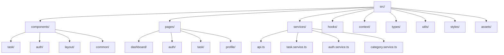
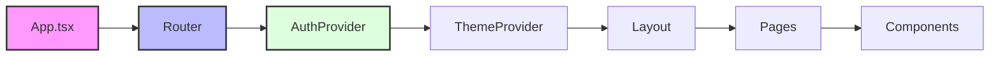
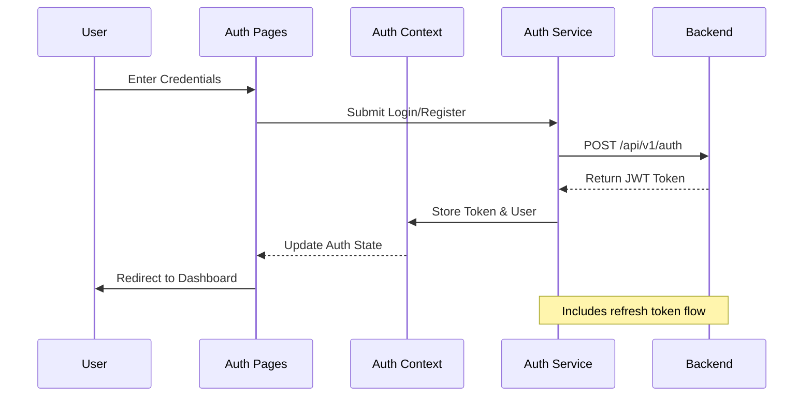
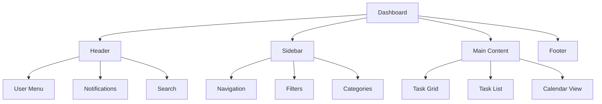
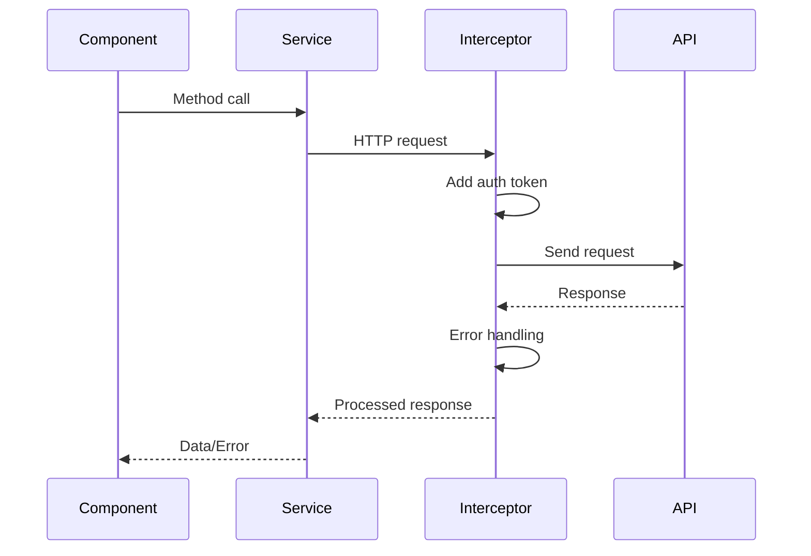

# TaskFlow Frontend Documentation

## Overview
TaskFlow is a sophisticated task management application engineered with modern web technologies. Built on React and TypeScript, it leverages Vite's rapid build system to deliver a high-performance user experience. The application implements a responsive design system using Tailwind CSS and Next UI components, ensuring a consistent and professional look across all devices and screen sizes.

## Technology Stack

| Category | Technology | Purpose |
|----------|------------|----------|
| Core | React 18 | UI library with concurrent features |
| Language | TypeScript 5.0 | Type-safe development |
| Build Tool | Vite 4.0 | Fast development and optimized builds |
| Styling | Tailwind CSS 3.0 | Utility-first CSS framework |
| UI Framework | Next UI | Modern, accessible component library |
| State Management | React Context API | Centralized state management |
| Form Management | React Hook Form | Efficient form handling and validation |
| HTTP Client | Axios | API communication with interceptors |
| Authentication | OAuth 2.0 | Secure user authentication |
| Date Handling | date-fns | Comprehensive date manipulation |

## Project Architecture

### Directory Structure



### Core Application Flow



### Authentication System



## Core Features

### Task Management System

The task management system is built around a robust CRUD architecture with the following key components:

#### Task Creation Flow
1. User initiates task creation from dashboard
2. Dynamic form with real-time validation
3. Category and priority selection
4. DateTime picker for due dates
5. Optional file attachments
6. Auto-save draft functionality

#### Task States
| State | Description | Visual Indicator |
|-------|-------------|------------------|
| TODO | Initial state | Gray badge |
| IN_PROGRESS | Active tasks | Blue badge |
| COMPLETED | Finished tasks | Green badge |
| BLOCKED | Impediment present | Red badge |

#### Priority Levels
| Level | Visual | Use Case |
|-------|---------|----------|
| HIGH | Red indicator | Urgent tasks |
| MEDIUM | Yellow indicator | Standard tasks |
| LOW | Green indicator | Background tasks |

### User Interface Components

#### Dashboard Layout


#### Component Hierarchy
| Component | Purpose | Features |
|-----------|---------|-----------|
| TaskCard | Task display | Drag-n-drop, Quick actions |
| TaskForm | Task creation/editing | Validation, Auto-save |
| TaskFilter | List filtering | Multi-select, Search |
| CategoryManager | Category operations | CRUD, Color picker |

### State Management Architecture

The application uses a layered state management approach:

1. **Global State** (Context API)
   - Authentication state
   - Theme preferences
   - Global notifications

2. **Feature State** (Local Context)
   - Task list state
   - Form state
   - UI component state

3. **Component State** (useState)
   - Temporary UI states
   - Form input values
   - Toggle states

### API Integration

#### Endpoint Structure

| Endpoint | Methods | Purpose |
|----------|---------|----------|
| /api/v1/tasks | GET, POST, PUT, DELETE | Task management |
| /api/v1/categories | GET, POST, PUT, DELETE | Category management |
| /api/v1/auth | POST, PUT | Authentication |
| /api/v1/users | GET, PUT | User management |

#### Request/Response Flow


### Error Handling Strategy

#### HTTP Error Handling
```typescript
interface ErrorResponse {
  status: number;
  message: string;
  details?: Record<string, string>;
  timestamp: string;
}

const errorHandler = {
  400: 'Invalid request data',
  401: 'Authentication required',
  403: 'Access denied',
  404: 'Resource not found',
  500: 'Server error'
};
```

#### Form Validation
- Real-time field validation
- Custom error messages
- Field-level error states
- Form-level validation
- Cross-field validation rules

## Development Workflow

### Code Organization

```
src/
├── components/          # Reusable UI components
│   ├── task/           # Task-related components
│   ├── auth/           # Authentication components
│   └── common/         # Shared components
├── pages/              # Route components
├── hooks/              # Custom React hooks
├── context/            # React Context providers
├── services/           # API services
├── types/              # TypeScript definitions
└── utils/              # Helper functions
```

### Development Commands

| Command | Purpose | Usage |
|---------|---------|-------|
| `npm run dev` | Development server | Local development |
| `npm run build` | Production build | Deployment |
| `npm run lint` | Code linting | CI/CD pipeline |
| `npm run test` | Run tests | Development/CI |
| `npm run type-check` | TypeScript validation | Pre-commit |

## Security Implementation

### Authentication Flow
1. OAuth 2.0 implementation
2. JWT token management
3. Refresh token rotation
4. Secure token storage
5. CSRF protection
6. XSS prevention

### Data Protection
1. Input sanitization
2. Output encoding
3. Content Security Policy
4. Secure Headers
5. HTTPS enforcement

## Performance Optimizations

### Code Splitting Strategy
1. Route-based splitting
2. Component lazy loading
3. Dynamic imports
4. Prefetching critical chunks

### Resource Optimization
1. Image compression
2. CSS minification
3. Tree shaking
4. Bundle analysis
5. Caching strategies

## Contributing Guidelines

### Code Standards
1. ESLint configuration
2. Prettier formatting
3. TypeScript strict mode
4. Component documentation
5. Test coverage requirements

### Git Workflow
1. Feature branch model
2. Conventional commits
3. Pull request template
4. Code review process
5. CI/CD integration

## License
TaskFlow is licensed under the MIT License. See the LICENSE file for more details.
